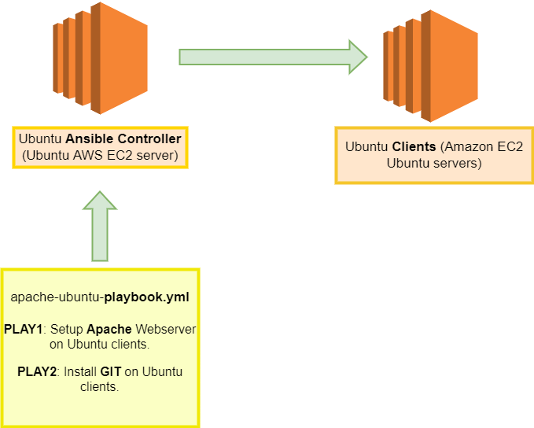

# Setup-Apache-Ansible

Ansible playbook called apache-ubuntu-playbook.yml with two (2) PLAYS as follow:

PLAY1: Setup an Apache Webserver on Ubuntu clients.

PLAY2: Install GIT on Ubuntu clients.

- Diagram:

For reference:

- https://docs.ansible.com/ansible/latest/collections/ansible/builtin/apt_module.html 
- https://docs.ansible.com/ansible/latest/collections/ansible/builtin/service_module.html 
- https://docs.ansible.com/ansible/latest/collections/ansible/builtin/copy_module.html
- https://www.ntweekly.com/2021/04/16/install-git-with-ansible-on-ubuntu-server-20-04/

