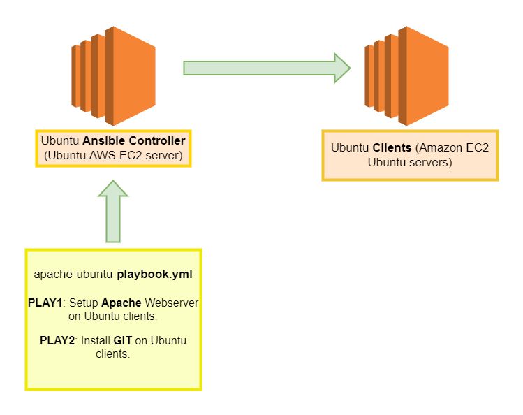

# Setup-Apache-Ansible

- Ansible playbook called apache-ubuntu-playbook.yml with two (2) PLAYS as follow:

- PLAY1: Setup an Apache Webserver on Ubuntu clients.

- PLAY2: Install GIT on Ubuntu clients.

# diagram:

# website:

- Display ansible diagram:

# for reference:

Ansible officiral documentation:

apt_module:

- https://docs.ansible.com/ansible/latest/collections/ansible/builtin/apt_module.html 

service_module:

- https://docs.ansible.com/ansible/latest/collections/ansible/builtin/service_module.html 

copy_module:

- https://docs.ansible.com/ansible/latest/collections/ansible/builtin/copy_module.html

How to install Git on Ubuntu server:

- https://www.ntweekly.com/2021/04/16/install-git-with-ansible-on-ubuntu-server-20-04/

